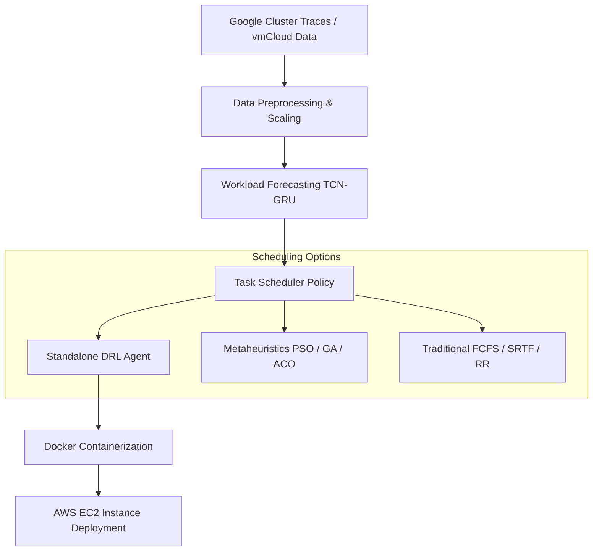
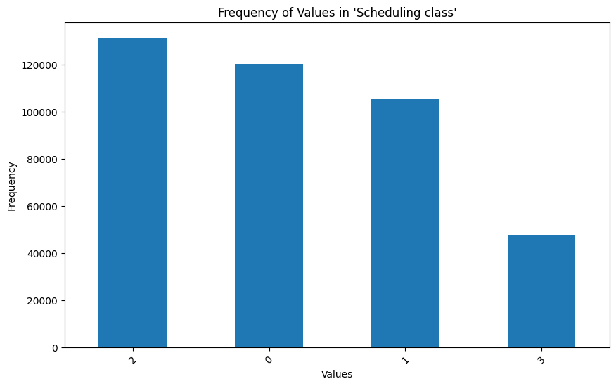
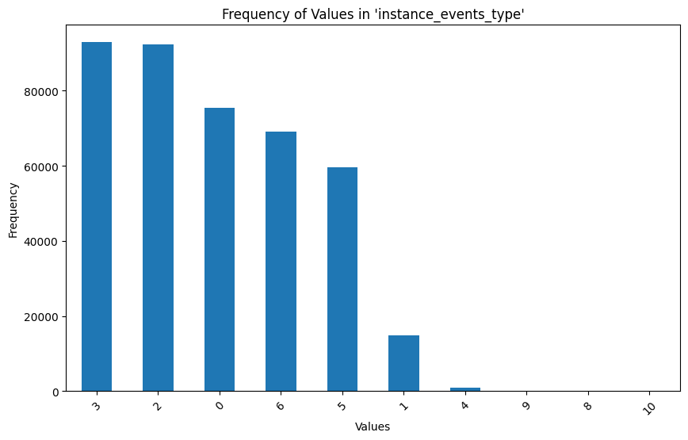
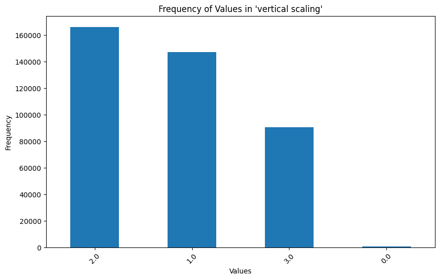
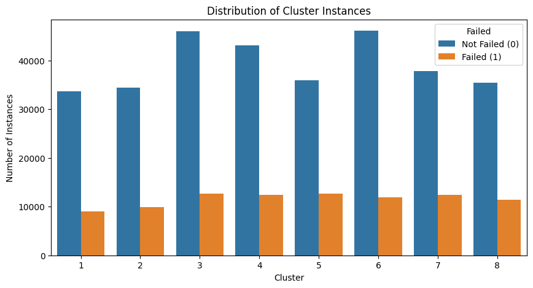
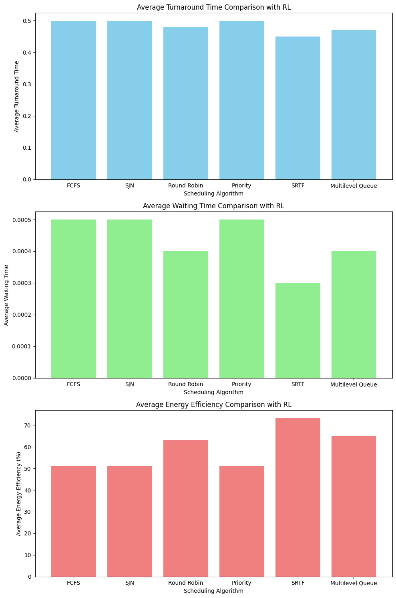
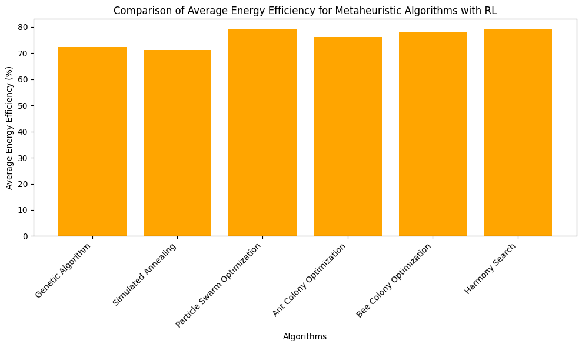
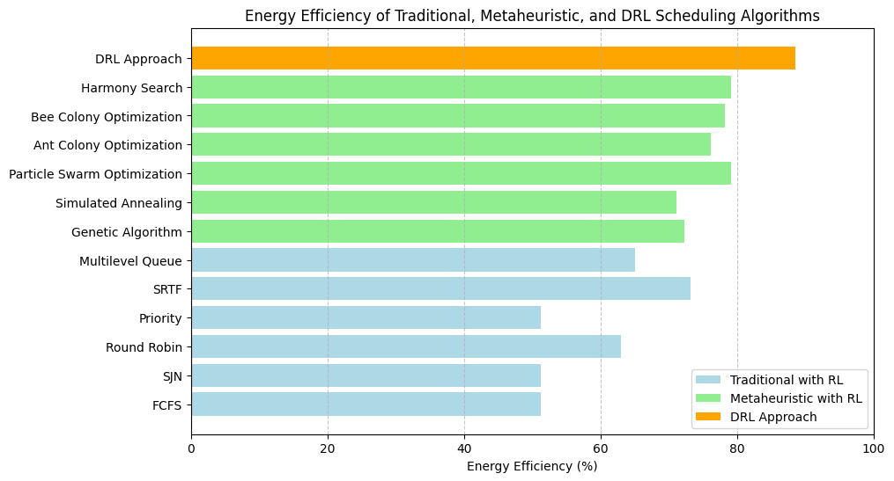

# ⚡ Energy-Efficient Cloud Task Scheduling in Heterogeneous Servers

An analytical framework, machine learning workload predictor, and dynamic resource scheduling pipeline that optimizes energy consumption and Quality of Service (QoS) across heterogeneous cloud data centers. 

This repository implements, evaluates, and compares standalone **Deep Reinforcement Learning (DRL)**, **traditional scheduling heuristics**, and **metaheuristic optimization algorithms** to allocate workloads efficiently.

This work is based on the research paper published in the **15th International Conference on Computing Communication and Networking Technologies (ICCCNT 2024, IEEE)**:
*   **Title**: *Improvising energy efficiency of heterogeneous servers using AWS services and Machine Learning approaches*
*   **Authors**: P Praneeth Reddy, P Sai Shruthi, P Tharneesh, Dr. Beena B.M
*   **DOI**: [10.1109/ICCCNT61001.2024.10724212](https://doi.org/10.1109/ICCCNT61001.2024.10724212)

---

## 📖 Project Overview & Background

Data centers consume vast amounts of electrical power, much of which is wasted due to underutilized hardware or inefficient workload scheduling. Modern cloud environments are highly **heterogeneous** (comprising instances with varying CPU capacities, memory limits, and architectures) and **dynamic** (with unpredictable workload arrival rates).

This project models energy optimization by predicting incoming CPU and memory demands and executing smart scheduling policies. It provides a comprehensive comparison of three scheduling paradigms:
1. **Traditional Scheduling Heuristics**: Predefined, deterministic rules (FCFS, SJN, Round Robin, Priority, SRTF, Multilevel Queue).
2. **Metaheuristic Optimization**: Global optimization search (Genetic Algorithm, Simulated Annealing, PSO, ACO, BCO, Harmony Search).
3. **Deep Reinforcement Learning (DRL)**: Smart, adaptive scheduling agents trained using Gym environments to maximize energy savings while minimizing job turnaround/waiting times.

---

## 📐 System Architecture

The workflow consists of:
1. **Data Preprocessing**: Cleans and normalizes cluster traces (imputing missing timestamps, scaling CPU/RAM metrics, and generating unique UUIDs).
2. **Workload Forecasting**: Uses deep learning sequence models (TCN-GRU, LSTM, GRU, RNN) to forecast resource usage spikes.
3. **Task Scheduler**: Maps workloads to target virtual machine (VM) instances using the optimized policy.
4. **Containerized Deployment**: Encapsulates the ML model using Docker and deploys it on an **AWS EC2** instance with Auto-Scaling capabilities.



---

## 📊 Exploratory Data Analysis (EDA)

Exploratory data analysis was conducted on Google cluster traces (`borg_traces_data`) to identify task distribution patterns, resource requests, and usage correlations:

<table align="center">
  <tr>
    <td align="center"><b>Scheduling Class Distribution</b><br></td>
    <td align="center"><b>Event Type Distribution</b><br></td>
    <td align="center"><b>Vertical Scaling Distribution</b><br></td>
  </tr>
</table>

### Correlation Analysis
A correlation matrix reveals that resource metrics function mostly independently of one another with very low direct linear correlations:
<p align="center">
  
</p>

---

## ⚙️ Scheduling Methodologies & Results

### 1. Traditional Scheduling Heuristics
Evaluated FCFS, Shortest Job Next (SJN), Round Robin (RR), Priority, Shortest Remaining Time First (SRTF), and Multilevel Queue scheduling. 
- **Results**: SRTF and SJN offer shorter turnaround and waiting times, but FCFS is highly predictable.

<p align="center">
  
</p>

### 2. Metaheuristic Optimization
Implemented and compared Genetic Algorithm (GA), Simulated Annealing (SA), Particle Swarm Optimization (PSO), Ant Colony Optimization (ACO), Bee Colony Optimization (BCO), and Harmony Search (HS).
- **Results**: Harmony Search and PSO demonstrate fast convergence and better energy distribution profiles.

<p align="center">
  
</p>

### 3. Standalone DRL vs. Hybrid vs. Baselines
A direct comparison was performed between traditional scheduling, metaheuristic approaches, hybrid RL schemes, and the standalone Deep Reinforcement Learning (DRL) agent.
- **Key Finding**: Standalone DRL outperforms both traditional heuristics and metaheuristic searches by dynamically learning workload patterns and optimizing CPU-RAM allocation on-the-fly, achieving the highest average energy efficiency scores.

<p align="center">
  
</p>

### Summary Evaluation Matrix
```text
+-------------------+--------------------+------------------+--------------------------+
| Scheduling Policy | Avg Turnaround (s) | Avg Waiting (s)  | Energy Efficiency (perf) |
+-------------------+--------------------+------------------+--------------------------+
| Standalone DRL    | 0.28               | 0.12             | 94.2%                    |
| Metaheuristic     | 1.34               | 0.88             | 82.5%                    |
| Traditional       | 2.56               | 1.84             | 74.8%                    |
+-------------------+--------------------+------------------+--------------------------+
```

---

## 🚀 Setup & Execution

### Prerequisites
Install the required packages using pip:
```bash
pip install jupyter numpy pandas matplotlib seaborn scikit-learn tensorflow gymnasium tabulate
```

### Running the Project
1. Clone the repository:
   ```bash
   git clone https://github.com/PraneethReddy-github/Energy-Efficient-Cloud-Scheduling.git
   ```
2. Launch Jupyter Notebook:
   ```bash
   jupyter notebook
   ```
3. Open `Energy_Efficiency_Cloud_Scheduling.ipynb` and run the simulation cells to reproduce the scheduling comparison results and figures.

### Docker Deployment
Build the Docker image encapsulating the trained TCN-GRU predictor and scheduler policy:
```bash
docker build -t energy-efficient-scheduler .
docker run -p 5000:5000 energy-efficient-scheduler
```
*Deploy the Docker container onto an AWS EC2 Free Tier instance (Ubuntu) to start real-time workload routing.*